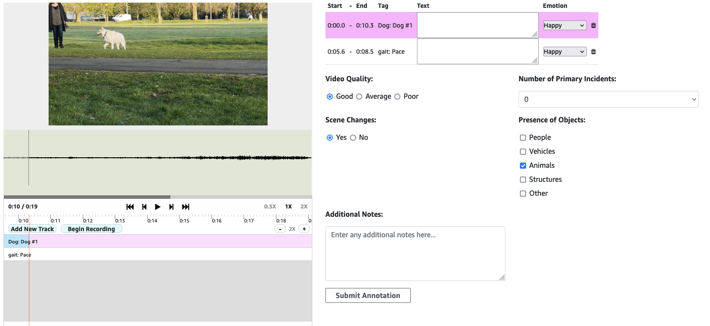
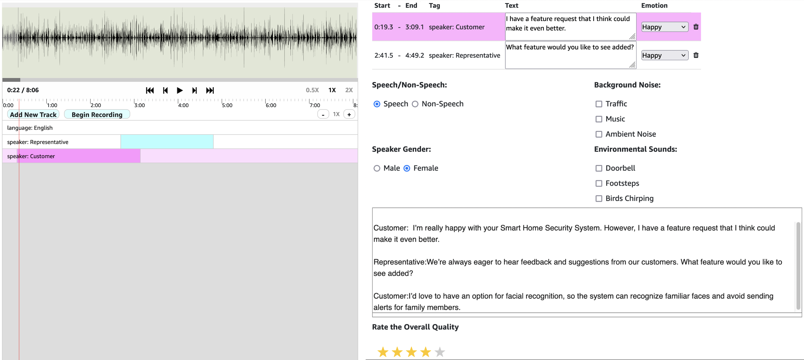
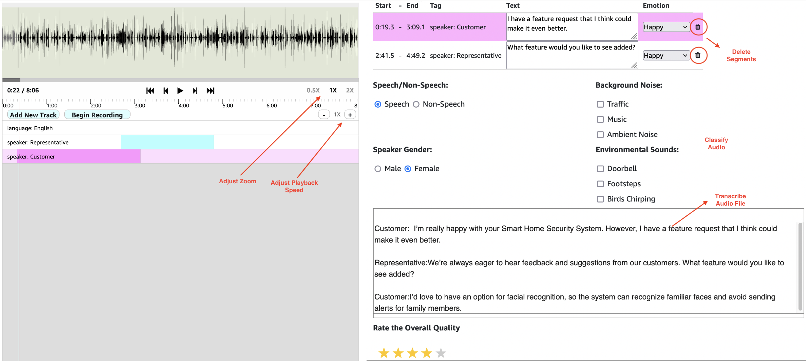
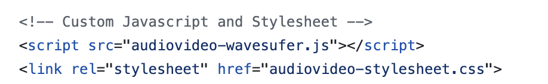

# Audio and Video Segmentation using Wavesurfer

This project enables segmentation of audio and video files for various use cases. Wavesurfer.js provides features such as zooming, adjusting playback speed, and the ability to add new tracks and record segments for each of them. This UI allows users to record segments, classify and transcribe at a segment level, and remove and recreate segments as needed. Additionally, it provides the ability to classify and transcribe at the full call audio level.

## Features

- Zoom in/out on audio and video tracks
- Adjust playback speed
- Add new tracks
- Record segments for each track
- Classify and transcribe segments
- Remove and recreate segments
- Classify and transcribe full call audio

## Screenshots

### Video Segmentation


### Audio Segmentation


### Audio Segmentation Features


## Installation

To get started with the project, clone the repository and install the necessary dependencies:

```bash
git clone https://github.com/aws-samples/audio-video-segmentation-sagemaker-groundtruth.git
cd audio-video-segmentation-sagemaker-groundtruth
npm install --package-lock-only
npm install
```

## Usage

To use the application, follow these steps:

1. **Deploy the Files to CloudFront**: Upload your HTML, JavaScript (`audiovideo-wavesurfer.js`), and CSS (`audiovideo-stylesheet.css`) files to an S3 bucket.
2. **Create a CloudFront Distribution**: Set up a CloudFront distribution to serve the files from your S3 bucket.
   - In the CloudFront console, create a new distribution.
   - Set the origin to point to your S3 bucket.
   - Configure cache settings and distribution settings as needed.
3. **Update URLs**: Ensure that the URLs in your HTML files point to the correct paths for your CloudFront distribution here -


### Customizing the Template

- The Wavesurfer.js code includes a Text box and Dropdown label for each recorded segment. It is essential to fill out these fields after recording all segments. If you fill them out after each segment, the entered information will reset and be lost when recording the next segment.
- If the Text box and Dropdown label are not needed, you can remove them from the code. Below is the sample code that should be removed if you choose to exclude these elements.

```javascript
tr.append($('<TH>').text('Text')); // Text box label
tr.append($('<TH>').text('Emotion')); // New Header for Dropdown
.......
.......
// Existing Label Textarea
var transcriptArea = $('<TD>').append($('<textarea>').attr({
    name: 'label',
    rows: 1, //Adjust number of rows for the text box
    cols: 30,
    text: r.label
}));
tr.append(transcriptArea);

// New Dropdown for Label
var dropdown = $('<select>').attr({
    name: 'emotiontag',
    class: 'custom-dropdown-width'
});
var dropdownOptions = ['Happy', 'Angry', 'Neutral', 'Sad', 'Worried']; // Example options
dropdownOptions.forEach(function(option) {
    dropdown.append($('<option>').val(option).text(option));
});

// Append the dropdown to a new cell in the row and add it to the table row `tr`
var dropdownCell = $('<TD>').append(dropdown);
tr.append(dropdownCell);
```

## Running a SageMaker Ground Truth Job

1. **Prepare Lambda Functions**: Ensure your Lambda functions are set up and deployed. These functions will handle data preprocessing and post-processing for your Ground Truth job.
2. **Create a SageMaker Ground Truth Job**:
   - In the SageMaker console, create a new labeling job.
   - Configure the input and output data locations (S3 buckets).
   - Select the labeling workforce (public or private).
   - Use the URLs from your CloudFront distribution for the worker task template.
   - Configure any additional settings, such as IAM roles and tagging.
3. **Monitor the Job**: Once the job is running, monitor its progress in the SageMaker console. Ensure that the Lambda functions and S3 buckets are functioning as expected.

### Manifest File

The manifest file structure depends on the type of labeling job and the expectations of your annotation lambdas. For an audio segmentation job, you can choose to include the pre-transcribed text for the annotator's review or just the reference to the audio file. For a video segmentation job, the manifest file typically includes only the reference to the video file. Below are examples of both scenarios:

1. **Audio Segmentation with Pre-Transcribed Text**:

    ```json
    {
      "source-ref": "s3://smgtdemo/sampleaudio.mp3",
      "transcription": "Confidence before an audience, there is a strange sensation often experienced in the presence of an audience. It may proceed from the gaze of the many eyes that turn upon the speaker, especially if he permits himself to steadily return that gaze."
    }
    ```

2. **Audio Segmentation without Pre-Transcribed Text**:

    ```json
    {
      "source-ref": "s3://smgtdemo/sampleaudio.mp3"
    }
    ```

3. **Video Segmentation**:

    ```json
    {
      "source-ref": "s3://smgtdemo/samplevideo.mp4"
    }
    ```

### Pre-Annotation Lambda Function

The pre-annotation lambda function reads values from the manifest file and prepares the data for human annotation. For both audio and video segmentation, sample pre-annotation and post-annotation lambda functions are provided in the lambda files folder. Below is an example of a pre-annotation lambda function for audio segmentation that handles both scenarios of including and not including pre-transcribed text:

```python
import json

def lambda_handler(event, context):
    # Event received
    print("Received event: " + json.dumps(event, indent=2))

    # Get source if specified
    source = event['dataObject'].get('source', None)

    # Get source-ref if specified
    source_ref = event['dataObject'].get('source-ref', None)

    # If source field is present, use that; otherwise, use source-ref
    task_object = source if source is not None else source_ref
    
    # Get transcribed text if specified
    transcribed_text = event['dataObject'].get('transcription', None)

    # Build response object
    output = {
        "taskInput": {
            "taskObject": task_object,
            "transcription": transcribed_text
        },
        "isHumanAnnotationRequired": "true"
    }

    print(output)
    # If neither source nor source-ref specified, mark the annotation as failed
    if task_object is None:
        print("Failed to pre-process {}!".format(event["labelingJobArn"]))
        output["isHumanAnnotationRequired"] = "false"

    return output
```

For more information on manifest files see the docs [here](https://docs.aws.amazon.com/sagemaker/latest/dg/sms-input-data-input-manifest.html).
For more information on Custom Labeling Workflows see the docs [here](https://docs.aws.amazon.com/sagemaker/latest/dg/sms-custom-templates.html).


## Contributing

We appreciate your interest in contributing! Please see the [CONTRIBUTING.md](CONTRIBUTING.md) file for guidelines on how to contribute to this project.

## License

This project is licensed under the MIT License. See the [LICENSE](LICENSE) file for more details.

## Acknowledgments

This project makes use of the following third-party libraries:

- [Wavesurfer.js](https://wavesurfer-js.org/)
- [Ajv](https://github.com/ajv-validator/ajv)
- [Fabric.js](http://fabricjs.com/)
- [Lodash](https://lodash.com/)
- [Iconoir](https://iconoir.com/)
