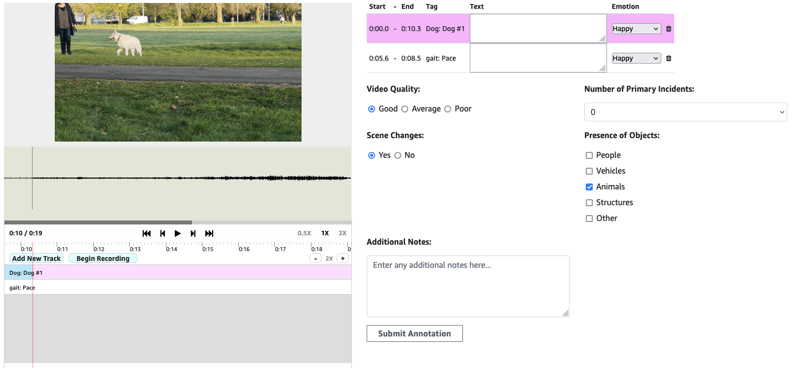
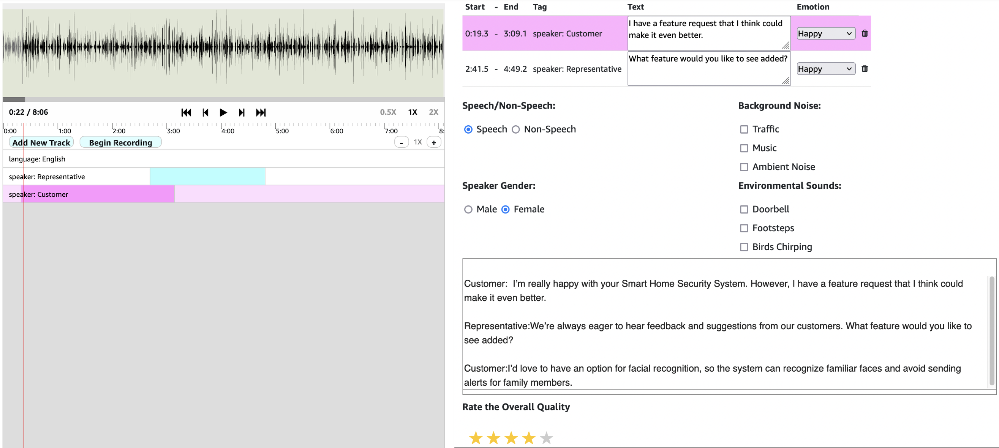

# User Guide for Audio and Video Segmentation using Wavesurfer

This user guide provides detailed instructions on how to use the Audio and Video Segmentation application powered by Wavesurfer.js.

## Table of Contents

1. [Introduction](#introduction)
2. [Getting Started](#getting-started)
3. [Using the Application](#using-the-application)
   - [Zooming](#zooming)
   - [Adjusting Playback Speed](#adjusting-playback-speed)
   - [Adding New Tracks](#adding-new-tracks)
   - [Recording Segments](#recording-segments)
   - [Classifying and Transcribing Segments](#classifying-and-transcribing-segments)
   - [Removing and Recreating Segments](#removing-and-recreating-segments)
   - [Classifying and Transcribing Full Call Audio](#classifying-and-transcribing-full-call-audio)
4. [Deploying the Project](#deploying-the-project)
   - [Deploying to CloudFront](#deploying-to-cloudfront)
5. [Running a SageMaker Ground Truth Job](#running-a-sagemaker-ground-truth-job)
6. [Screenshots](#screenshots)

## Introduction

The Audio and Video Segmentation application allows users to segment audio and video files for various use cases. Using Wavesurfer.js, users can zoom, adjust playback speed, add new tracks, and record segments. The application also supports classifying and transcribing segments and the full call audio.

## Getting Started

To get started, follow the [Installation](README.md#installation) instructions in the README file to set up the project.

## Using the Application

### Zooming

Use the zoom feature to get a closer or wider view of the audio or video track. This helps in identifying specific segments accurately.

### Adjusting Playback Speed

Adjust the playback speed to review the audio or video at different speeds. This can be useful for detailed analysis or quick review.

### Adding New Tracks

Add new tracks to the application to handle multiple audio or video files simultaneously. This feature is useful for comparing or combining different sources.

### Recording Segments

1. **Select a Track**: Choose the track you want to segment.
2. **Mark the Start and End Points**: Use the cursor to mark the start and end points of the segment.
3. **Record the Segment**: Click the record button to capture the segment.

### Classifying and Transcribing Segments

1. **Select a Segment**: Click on the segment you want to classify or transcribe.
2. **Classify the Segment**: Use the classification options to label the segment appropriately.
3. **Transcribe the Segment**: Enter the transcription for the segment in the provided text area.

### Removing and Recreating Segments

1. **Select a Segment**: Click on the segment you want to remove.
2. **Remove the Segment**: Click the delete button to remove the segment.
3. **Recreate the Segment**: Follow the steps in [Recording Segments](#recording-segments) to recreate the segment.

### Classifying and Transcribing Audio

1. **Classify the Audio**: Use the classification options to label the audio.
2. **Transcribe the Audio**: Enter the transcription for the audio in the provided text area.

### Customizing the Template

- The Wavesurfer.js code includes a Text box and Dropdown label for each recorded segment. It is essential to fill out these fields after recording all segments. If you fill them out after each segment, the entered information will reset and be lost when recording the next segment.
- If the Text box and Dropdown label are not needed, you can remove them from the code. Below is the sample code that should be removed if you choose to exclude these elements.

```javascript
tr.append($('<TH>').text('Text')); // Text box label
tr.append($('<TH>').text('Emotion')); // New Header for Dropdown
.......
.......
// Existing Label Textarea
var transcriptArea = $('<TD>').append($('<textarea>').attr({
    name: 'label',
    rows: 1, //Adjust number of rows for the text box
    cols: 30,
    text: r.label
}));
tr.append(transcriptArea);

// New Dropdown for Label
var dropdown = $('<select>').attr({
    name: 'emotiontag',
    class: 'custom-dropdown-width'
});
var dropdownOptions = ['Happy', 'Angry', 'Neutral', 'Sad', 'Worried']; // Example options
dropdownOptions.forEach(function(option) {
    dropdown.append($('<option>').val(option).text(option));
});

// Append the dropdown to a new cell in the row and add it to the table row `tr`
var dropdownCell = $('<TD>').append(dropdown);
tr.append(dropdownCell);
```

## Deploying the Project

### Deploying to CloudFront

1. **Upload Files to S3**: Upload your HTML, JavaScript (`audiovideo-wavesurfer.js`), and CSS (`audiovideo-stylesheet.css`) files to an S3 bucket.
2. **Create CloudFront Distribution**: Set up a CloudFront distribution to serve the files from your S3 bucket.
   - In the CloudFront console, create a new distribution.
   - Set the origin to point to your S3 bucket.
   - Configure cache settings and distribution settings as needed.
3. **Update URLs**: Ensure that the URLs in your HTML files point to the correct paths for your CloudFront distribution.

## Running a SageMaker Ground Truth Job

1. **Prepare Lambda Functions**: Ensure your Lambda functions are set up and deployed. These functions will handle data preprocessing and post-processing for your Ground Truth job.
2. **Create a SageMaker Ground Truth Job**:
   - In the SageMaker console, create a new labeling job.
   - Configure the input and output data locations (S3 buckets).
   - Select the labeling workforce (public or private).
   - Use the URLs from your CloudFront distribution for the worker task template.
   - Configure any additional settings, such as IAM roles and tagging.
3. **Monitor the Job**: Once the job is running, monitor its progress in the SageMaker console. Ensure that the Lambda functions and S3 buckets are functioning as expected.

## Screenshots

### Video Segmentation


### Audio Segmentation


### Audio Segmentation Features


For more detailed information, refer to the [README.md](README.md) file.

Thank you for using the Audio and Video Segmentation application!
